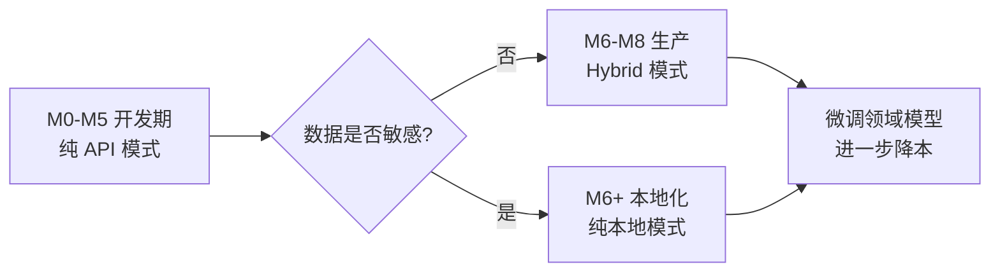

# LLM 算力方案对比分析 — 本地 vs API

> 适用：科研自动化 Agent 系统（国产模型）
> 决策原则：**先 API 验证流程，再本地化降本；hybrid 模式作为生产态**
> 创建日期：2026-06-28

---

## 1. 三种模式总览

| 模式 | 描述 | 适用阶段 |
|---|---|---|
| **API 模式** | 全部调用国产模型厂商 API（DeepSeek / GLM / Qwen / Kimi） | M0–M5 开发验证期 |
| **本地模式** | 全部模型本地部署（Ollama / vLLM） | M7 之后，数据敏感场景 |
| **Hybrid 模式** | 强模型走 API，廉/嵌入模型本地 | M8 生产态推荐 |

---

## 2. 方案 A：API 模式

### 2.1 推荐模型组合

| 档位 | 模型 | 厂商 | 上下文 | 价格（输入/输出 ¥/百万 token） |
|---|---|---|---|---|
| 强（推理/写作） | `deepseek-reasoner`（R1） | DeepSeek | 64K | 4 / 16（非高峰 1 / 4） |
| 廉（抽取/格式化） | `deepseek-chat`（V3） | DeepSeek | 64K | 2 / 8 |
| 长文（综述） | `moonshot-v1-200k` | Kimi | 200K | 60 / 60 |
| 嵌入（向量） | `bge-m3` API | 智源 | 8K | 0.7 |

### 2.2 优势

- ✅ **零部署成本**，注册 key 即用；
- ✅ **算力弹性无限**，并发不受限；
- ✅ **模型最新**，自动享受厂商升级（如 DeepSeek-R2、GLM-5）；
- ✅ **国产模型中文能力业内最强**，远超自部署小模型；
- ✅ **延迟低**，首 token 1–3 秒。

### 2.3 劣势

- ❌ **数据出域**：文献、实验数据上传第三方，敏感场景受限；
- ❌ **持续成本**：按 token 累计，长期使用贵；
- ❌ **依赖网络与厂商 SLA**：限流、宕机影响流程；
- ❌ **国产模型工具调用偶发不稳定**：需重试兜底。

### 2.4 成本估算（单次完整科研流程）

| 阶段 | 强模型 token | 廉模型 token | 长文 token | 嵌入 token | 估算成本 |
|---|---|---|---|---|---|
| 文献调研 | 5K | 30K | 200K | 500K | ¥14 |
| 实验设计 | 15K | 10K | — | — | ¥14 |
| 实验执行（代码生成） | 20K | 30K | — | — | ¥16 |
| 结果评价 | 10K | 20K | — | — | ¥9 |
| 讨论生成 | 15K | 5K | 50K | — | ¥10 |
| 论文撰写 | 40K | 20K | 100K | — | ¥26 |
| 配图与编译 | 5K | 10K | — | — | ¥5 |
| **合计** | **110K** | **125K** | **350K** | **500K** | **≈ ¥94** |

> 单次完整流程约 **¥94**；若多次迭代（典型 5 轮）约 **¥470**。

---

## 3. 方案 B：本地模式

### 3.1 推荐模型组合（按硬件分档）

| 硬件档位 | 显存 | 强模型 | 廉模型 | 嵌入 | 备注 |
|---|---|---|---|---|---|
| **入门** | 16GB（如 4080） | Qwen2.5-7B-Instruct | Qwen2.5-7B | bge-base-zh | 量化 Q4，质量略降 |
| **中端** | 24GB（如 3090/4090） | Qwen2.5-14B / GLM-4-9B | Qwen2.5-7B | bge-large-zh | 推荐 |
| **高端** | 48–80GB（A6000/A100） | DeepSeek-R1-Distill-32B | Qwen2.5-14B | bge-m3 | 接近 API 质量 |
| **工作站** | 2×A100 80GB | Qwen2.5-72B / DeepSeek-V3 蒸馏 | Qwen2.5-32B | bge-m3 | 全本地高质量 |
| **CPU 兜底** | 无 GPU | Qwen2.5-1.5B（llama.cpp） | 同上 | bge-small | 仅作演示 |

**长上下文**：本地部署 200K 上下文不现实，建议长文用 API 兜底（即 hybrid）。

### 3.2 部署栈

```
vLLM (高吞吐推理) ─┐
                   ├─→ OpenAI 兼容 API → LangChain ChatOpenAI 接入
Ollama (易用)    ─┘
bge-m3 via sentence-transformers / FlagEmbedding
```

### 3.3 优势

- ✅ **数据不出域**：敏感文献、未发表数据安全；
- ✅ **零边际成本**：跑多少次都不额外付费；
- ✅ **无限并发**：受本地算力限制但不被限流；
- ✅ **可定制**：可对模型做科研领域微调（如 LoRA）。

### 3.4 劣势

- ❌ **初始投入高**：单张 4090 ≈ ¥1.6 万，A100 ≈ ¥10 万；
- ❌ **质量上限低于 API**：本地 32B 不及 DeepSeek-R1 671B；
- ❌ **显存瓶颈**：长上下文（>32K）推理慢且贵；
- ❌ **运维成本**：vLLM 升级、模型更新、显存调优；
- ❌ **中文写作能力**：本地 7B–14B 写作明显弱于 API 的 R1 / GLM-4.5。

### 3.5 成本估算

| 项 | 一次性 | 持续 |
|---|---|---|
| GPU 硬件（24GB 推荐） | ¥1.6 万 | — |
| 电费（300W × 24h） | — | ¥0.4/天 ≈ ¥150/年 |
| 模型微调（可选） | ¥0（自跑） | — |
| **跑 100 次流程总成本** | **¥1.6 万 + ¥150** | |

> 对比 API：100 次流程 ≈ ¥9400。**跑约 17 次流程以上本地回本**。

---

## 4. 方案 C：Hybrid 模式（推荐生产态）

### 4.1 路由策略

| 任务类型 | 路由 | 理由 |
|---|---|---|
| 文献综述（长文） | API（Kimi 200K） | 本地无法跑长上下文 |
| 假设生成 / 论文撰写 | API（DeepSeek-R1） | 质量优先，token 量小 |
| 实验代码生成 | 本地（Qwen2.5-14B） | 量大、可接受稍弱 |
| 抽取 / 格式化 / 分类 | 本地（Qwen2.5-7B） | 量大、任务简单 |
| 嵌入（向量库） | 本地（bge-m3） | 调用频繁、本地最优 |
| HIL 期间的小工具调用 | 本地 | 低延迟 |

### 4.2 成本对比

| 模式 | 单次成本 | 5 次迭代 | 100 次 | 质量评级 |
|---|---|---|---|---|
| 纯 API | ¥94 | ¥470 | ¥9400 | ⭐⭐⭐⭐⭐ |
| 纯本地（24GB） | ¥1.5（电费） | ¥7.5 | ¥150 + 硬件 ¥1.6万 | ⭐⭐⭐⭐ |
| **Hybrid** | **¥35** | **¥175** | **¥3500 + 硬件** | ⭐⭐⭐⭐⭐ |

> Hybrid 比纯 API 节省约 **63%** 成本，质量持平。

---

## 5. 决策矩阵

| 维度 | 权重 | API | 本地 | Hybrid |
|---|---|---|---|---|
| 部署难度 | 15% | 10 | 4 | 6 |
| 单次成本 | 20% | 4 | 10 | 8 |
| 数据隐私 | 15% | 2 | 10 | 7 |
| 模型质量 | 25% | 10 | 6 | 9 |
| 长上下文支持 | 10% | 10 | 3 | 8 |
| 并发稳定性 | 10% | 6 | 9 | 9 |
| 运维负担 | 5% | 10 | 4 | 6 |
| **加权总分** | 100% | **7.05** | **6.55** | **8.05** ✅ |

---

## 6. 推荐路径



### 阶段建议

| 阶段 | 模式 | 目的 |
|---|---|---|
| **M0–M5** | 纯 API | 快速验证流程，零运维负担 |
| **M6 通用性验证** | 纯 API | 跨学科 case 跑通 |
| **M7 LLM 双模式** | API + 本地 + Hybrid | 验证三种模式可切换 |
| **M8 云端化** | Hybrid | 生产态，降本 |
| **后续** | Hybrid + 领域微调 | 进一步优化成本与质量 |

---

## 7. 接入实现要点

### 7.1 统一抽象

```python
from langchain_openai import ChatOpenAI
from langchain_community.chat_models import ChatOllama

def get_llm(tier: str, config):
    """tier: strong | cheap | long | embed"""
    mode = config.llm.mode  # api | local | hybrid

    # hybrid 路由表
    hybrid_route = {
        "strong": "api",      # 强模型永远走 API
        "long":   "api",      # 长文永远走 API
        "cheap":  "local",    # 廉模型本地
        "embed":  "local",    # 嵌入本地
    }
    use = mode if mode != "hybrid" else hybrid_route[tier]

    if use == "api":
        return ChatOpenAI(
            base_url=_provider_base(config.llm.provider),
            model=_pick_model(tier, config, "api"),
            api_key=_api_key(config.llm.provider),
        )
    else:
        return ChatOllama(
            base_url=config.llm.local_base_url,
            model=_pick_model(tier, config, "local"),
        )
```

### 7.2 失败兜底链

```python
STRONG_FALLBACK = ["deepseek-reasoner", "glm-4.5", "qwen-max", "kimi-k2"]
CHEAP_FALLBACK  = ["deepseek-chat", "glm-4-flash", "qwen-turbo"]

def call_with_fallback(tier, prompt):
    chain = STRONG_FALLBACK if tier == "strong" else CHEAP_FALLBACK
    for model in chain:
        try:
            return llm_invoke(model, prompt, timeout=60)
        except (RateLimit, Timeout, JSONError):
            continue
    raise RuntimeError(f"all fallbacks exhausted for {tier}")
```

### 7.3 Token 预算守门

```python
class TokenBudget:
    def __init__(self, total=500_000):
        self.used = 0
        self.total = total

    def consume(self, n):
        if self.used + n > self.total:
            raise BudgetExceeded(f"used={self.used}, want={n}, cap={self.total}")
        self.used += n
```

---

## 8. 本地部署硬件清单（参考）

| 配置 | GPU | 显存 | 适配模型 | 估价 |
|---|---|---|---|---|
| 入门 | RTX 4080 | 16GB | Qwen2.5-7B Q4 | ¥1.0 万 |
| **推荐** | RTX 4090 | 24GB | Qwen2.5-14B Q4 / GLM-4-9B | ¥1.6 万 |
| 高端 | RTX A6000 | 48GB | DeepSeek-R1-Distill-32B Q4 | ¥4.5 万 |
| 工作站 | 2×A100 80G | 160GB | Qwen2.5-72B / 接近 API 质量 | ¥20 万 |
| Mac 替代 | M3 Ultra 192G | 192GB 统一 | MLX 部署 Qwen2.5-32B | ¥6 万 |

---

## 9. 结论

| 场景 | 推荐方案 |
|---|---|
| 项目初期开发验证（M0–M5） | **纯 API** |
| 数据敏感（医疗 / 未公开数据） | **纯本地**（推荐 24GB+） |
| 长期生产使用、成本敏感 | **Hybrid** |
| 预算极紧、能接受质量降级 | 本地 Qwen2.5-7B + bge-small |
| 质量优先、不在乎成本 | 纯 API + DeepSeek-R1 |

**项目默认路径**：M0–M5 纯 API（DeepSeek + Kimi）→ M7 验证 Hybrid → M8 生产用 Hybrid（强模型 API + 廉/嵌入本地）。
