# 科研自动化 Agent 系统 — 流程图

> 适用：通用学科 / 通用领域
> Agent 框架：**LangGraph**（状态机 + checkpoint + interrupt，原生支持 Human-in-the-loop 与长流程恢复）
> 部署：本地（开发验证）→ 云端（生产运行）

---

## 一、系统总体架构图

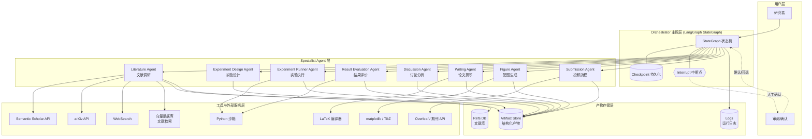

---

## 二、主流程时序图（端到端）

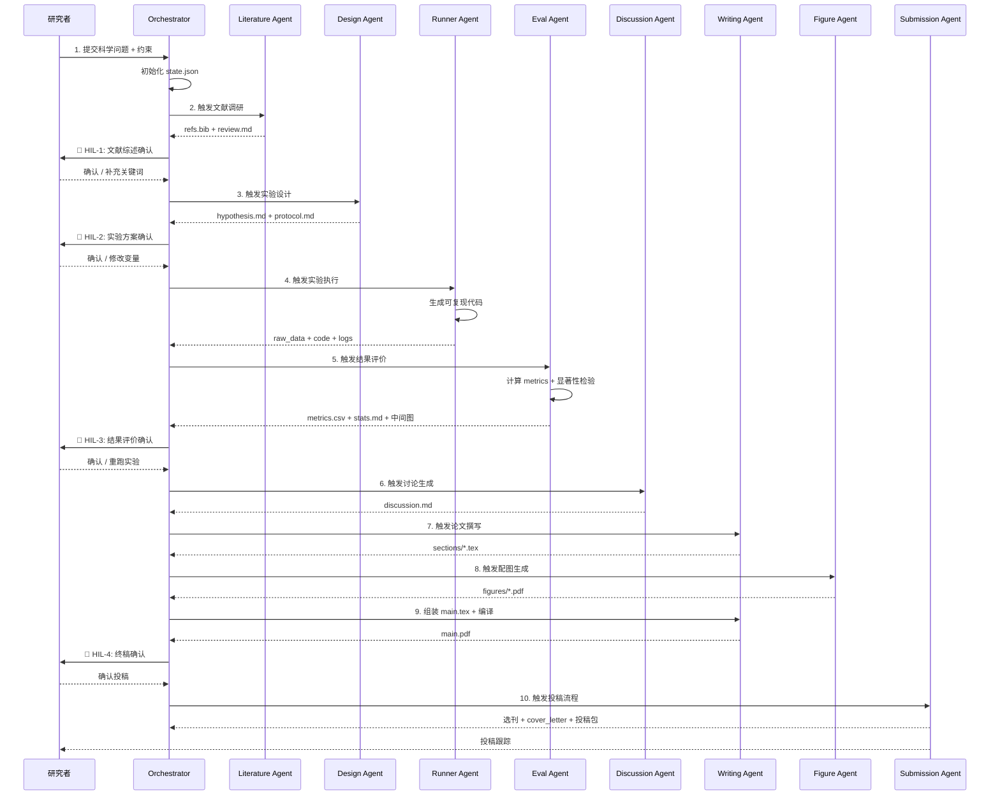

---

## 三、状态机图（LangGraph StateGraph）

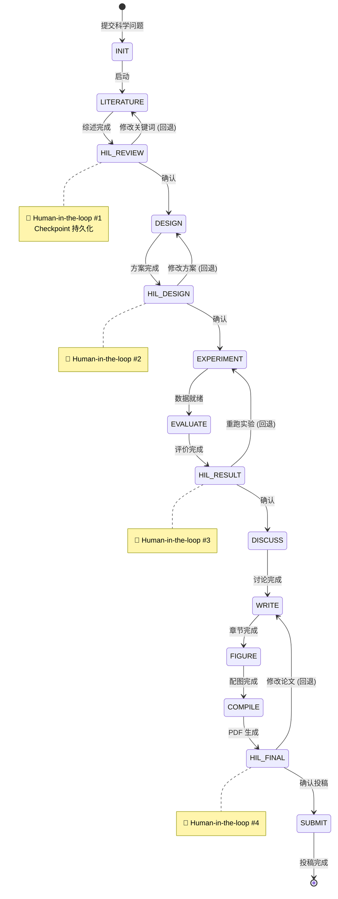

---

## 四、数据流图（Artifact 流转）

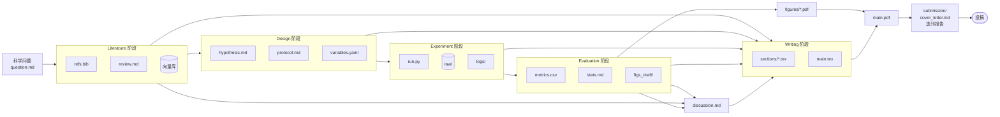

---

## 五、Agent 依赖与调用关系图

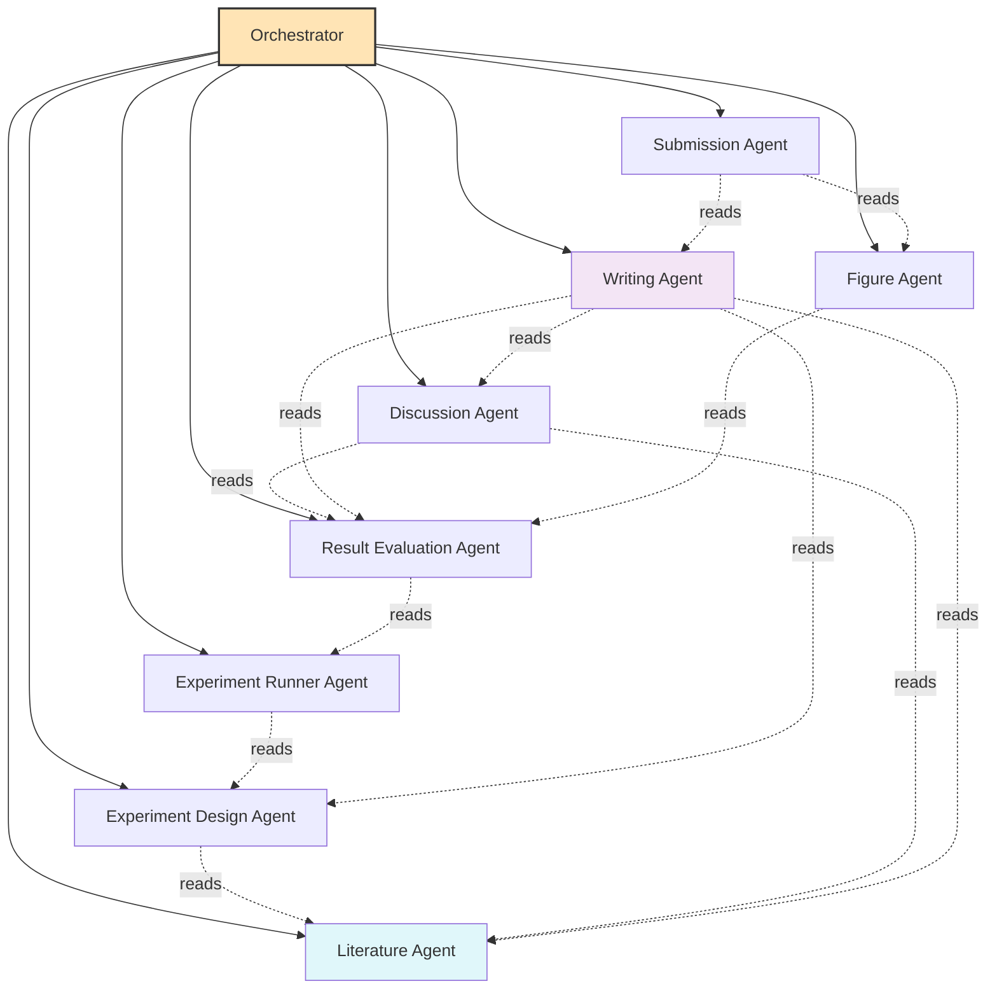

---

## 六、本地 → 云端演进流程

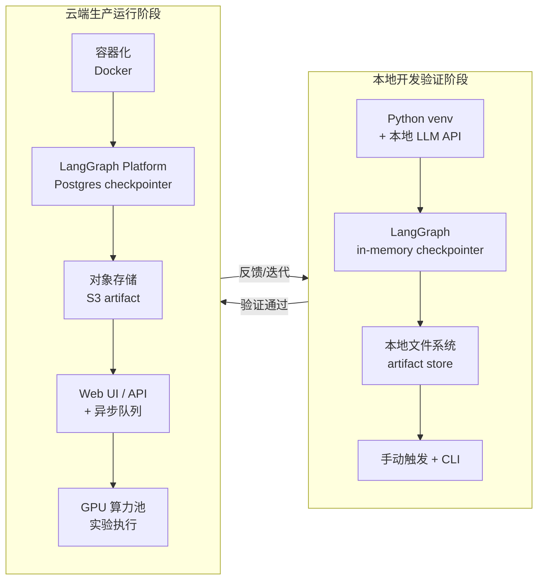

---

## 七、关键子流程：实验执行 Agent 内部流程

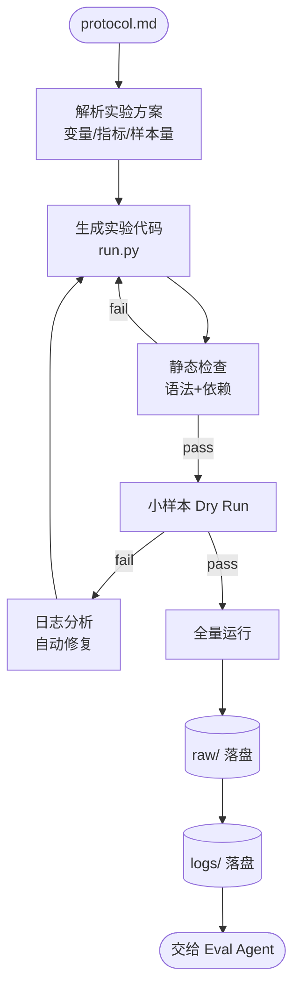

---

## 八、HIL（Human-in-the-loop）中断恢复机制

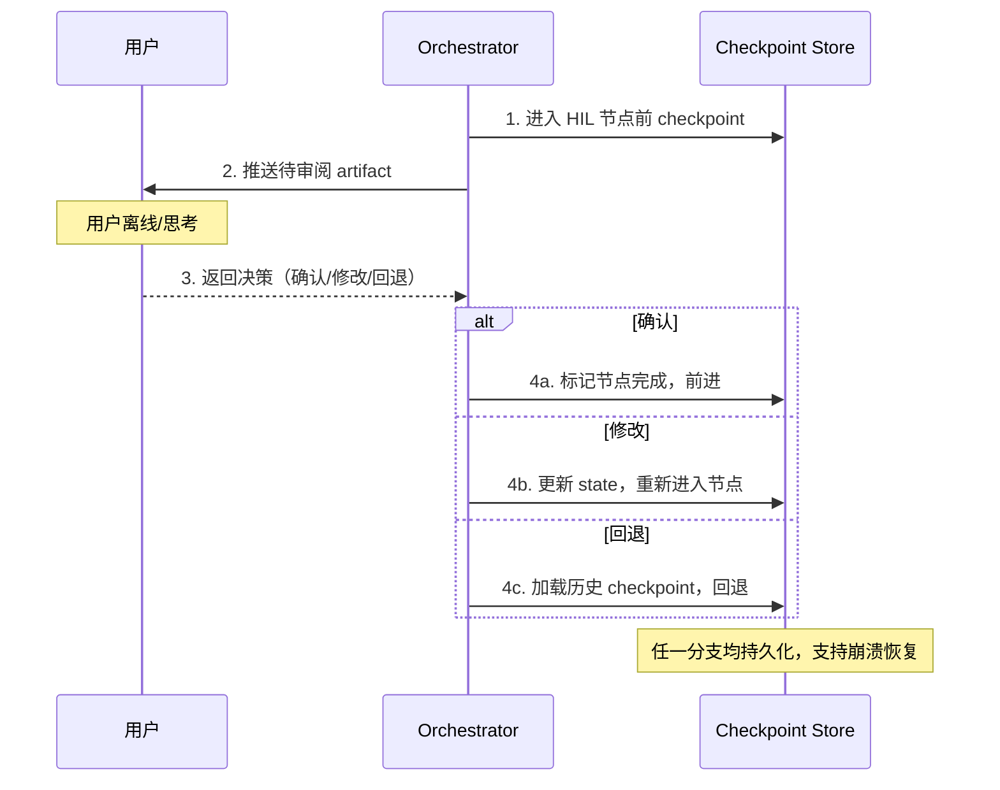

---

## 九、版本管理流程（多轮实验迭代）

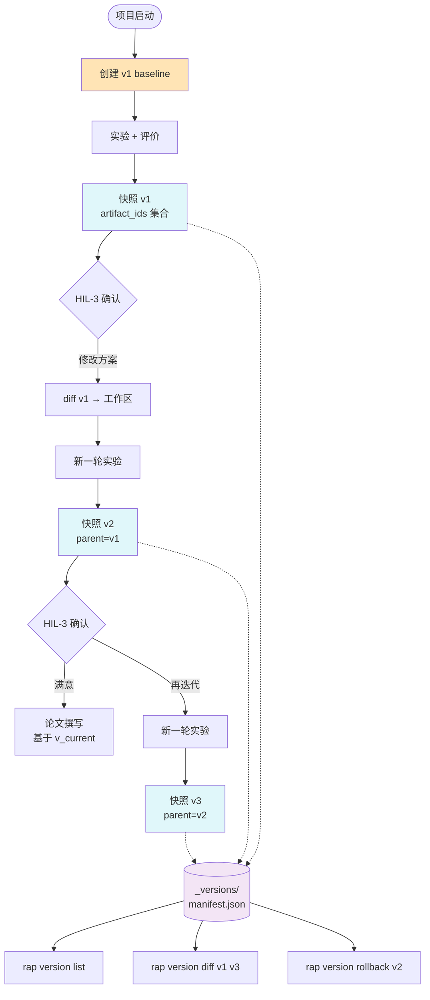

---

## 十、LLM 路由流程（API / 本地 / Hybrid）

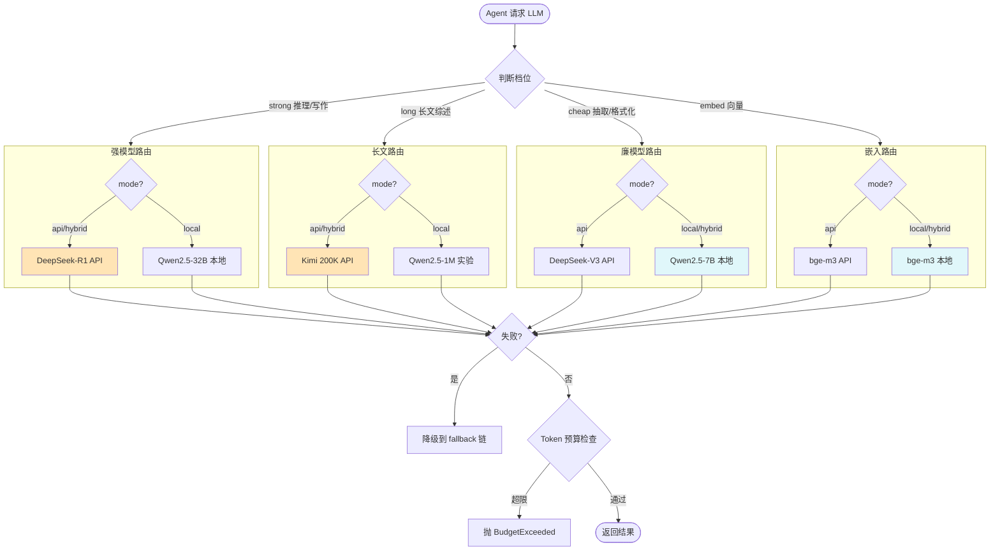

---

## 十一、中文论文生成流程（CTeX 模板）

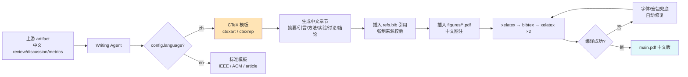

