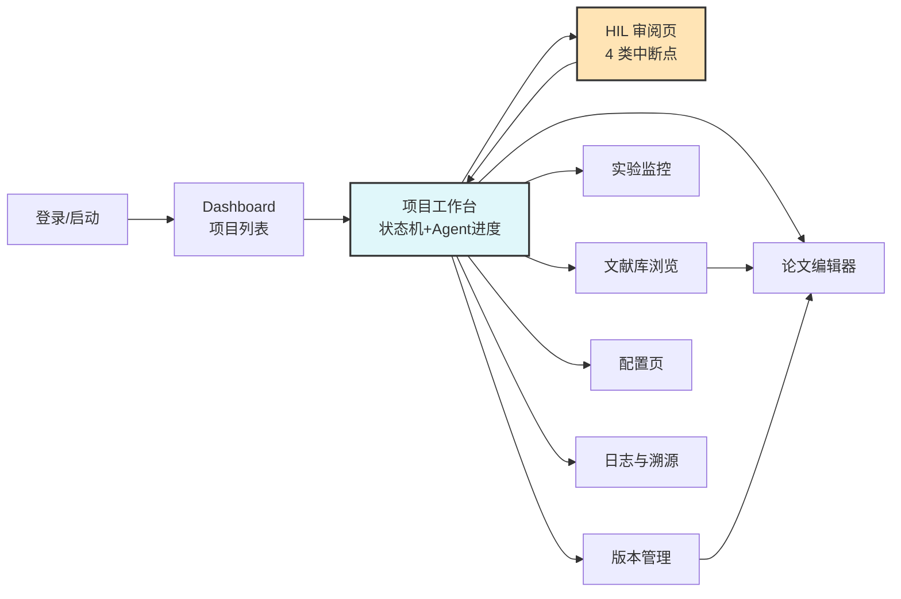
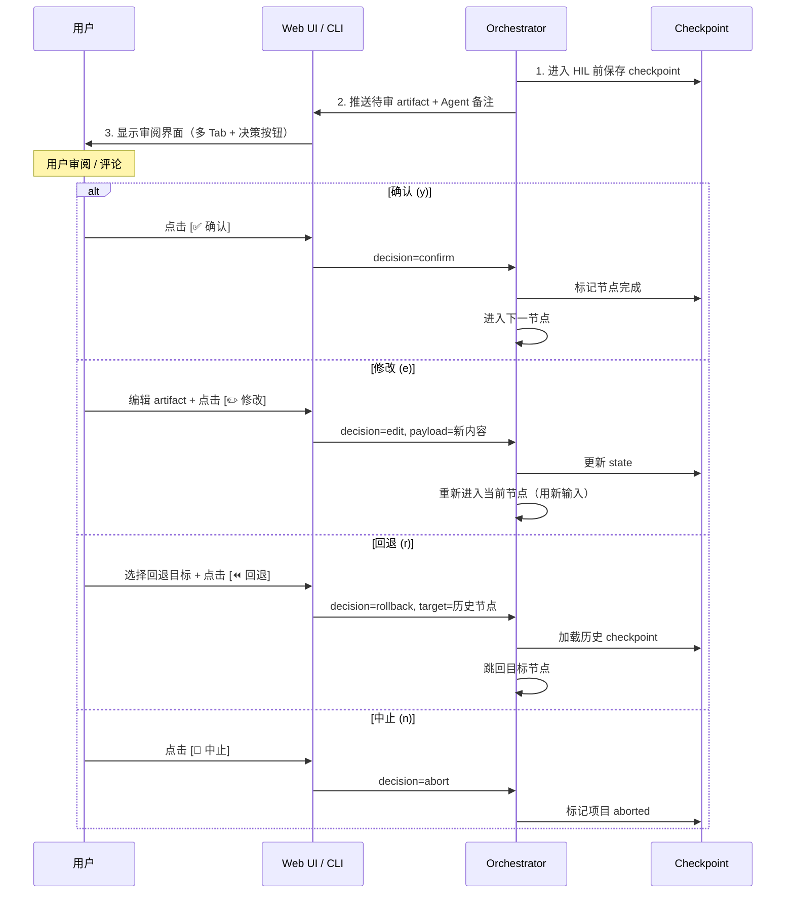

# UI 原型与界面设计

> 科研自动化 Agent 系统 / Web UI + CLI
> v1.0 / 2026-06-28
> 设计原则：**信息密度高、状态可追溯、HIL 操作极简**

---

## 一、页面流转图（IA）



---

## 二、全局布局（所有页面共享）

```
┌──────────────────────────────────────────────────────────────────────────┐
│ 🧪 Research Auto-Pilot   [项目: case-001 ▼]   [⏸暂停] [▶继续]  👤user  │
├──────────┬───────────────────────────────────────────────────────────────┤
│ 侧边栏    │                                                                │
│          │                                                                │
│ 📊 概览   │                  主内容区                                       │
│ 📚 文献   │                                                                │
│ 🧪 实验   │                                                                │
│ 📝 论文   │                                                                │
│ 🗂 版本   │                                                                │
│ ⚙ 配置    │                                                                │
│ 📜 日志   │                                                                │
│          │                                                                │
│ ─────── │                                                                │
│ 状态指示  │                                                                │
│ 🟢 运行中 │                                                                │
│ v3 当前  │                                                                │
└──────────┴───────────────────────────────────────────────────────────────┘
```

**顶部固定栏**：项目切换、全局控制（暂停/继续/中止）、用户
**侧边栏**：8 大功能模块导航 + 当前版本/状态指示
**主内容区**：随导航切换

---

## 三、Dashboard（项目列表）

```
┌──────────────────────────────────────────────────────────────────────────┐
│  Dashboard                                                    [+ 新建项目] │
├──────────────────────────────────────────────────────────────────────────┤
│                                                                          │
│  🔍 [搜索项目...]    [全部▾] [运行中▾] [学科▾]                            │
│                                                                          │
│  ┌────────────────────┐  ┌────────────────────┐  ┌────────────────────┐ │
│  │ case-001           │  │ case-002           │  │ case-003           │ │
│  │ 🟢 运行中          │  │ 🟡 HIL 待审        │  │ ⚪ 已完成          │ │
│  │ NLP / Mamba对比    │  │ 材料 / 钙钛矿      │  │ 生物 / GEO差异     │ │
│  │ 当前节点: EVALUATE │  │ 等待: HIL-DESIGN   │  │ 已投稿             │ │
│  │ v3 / 进度 60%      │  │ v1 / 进度 25%      │  │ v5 / 进度 100%     │ │
│  │ 更新: 2分钟前      │  │ 更新: 1小时前      │  │ 更新: 昨天         │ │
│  │ [打开] [继续]      │  │ [打开] [审阅]      │  │ [打开] [归档]      │ │
│  └────────────────────┘  └────────────────────┘  └────────────────────┘ │
│                                                                          │
│  ┌────────────────────────────────────────────────────────────────────┐ │
│  │ 📈 7日活跃: 12 个项目 | 总 token: 4.2M | 总成本: ¥385              │ │
│  └────────────────────────────────────────────────────────────────────┘ │
└──────────────────────────────────────────────────────────────────────────┘
```

**卡片信息**：项目名 / 状态灯 / 学科 / 描述 / 当前节点 / 版本 / 进度条 / 更新时间 / 快捷动作

---

## 四、项目工作台（核心页面）

```
┌──────────────────────────────────────────────────────────────────────────┐
│  case-001 / Mamba vs Transformer 长文本对比                                │
├──────────────────────────────────────────────────────────────────────────┤
│                                                                          │
│  状态机可视化：                                                          │
│                                                                          │
│  [INIT]─✅─[LITERATURE]─✅─[HIL_REVIEW]─✅─[DESIGN]─✅─[HIL_DESIGN]─✅─   │
│        ─[EXPERIMENT]─✅─[EVALUATE]─🟢当前─[HIL_RESULT]─⏳─[DISCUSS]─⏳─   │
│        ─[WRITE]─⏳─[FIGURE]─⏳─[COMPILE]─⏳─[HIL_FINAL]─⏳─[SUBMIT]       │
│                                                                          │
│  ┌──────────────────────────────┬───────────────────────────────────────┐│
│  │ 🤖 当前 Agent: EVALUATE      │ 📦 最近产物                            ││
│  │ 已运行: 2分18秒              │                                       ││
│  │ Token: 12.4K (强) + 8.2K(廉) │ ✅ metrics.csv     2 KB   1分钟前      ││
│  │ 成本: ¥0.18                  │ ✅ stats.md        4 KB   1分钟前      ││
│  │                              │ 🔄 figs_draft/     生成中...           ││
│  │ [查看日志]                    │                                       ││
│  │ [中断]  [暂停]                │ [全部产物 →]                          ││
│  └──────────────────────────────┴───────────────────────────────────────┘│
│                                                                          │
│  ┌──────────────────────────────────────────────────────────────────────┐│
│  │ 📋 实时日志（最后 20 行）                                              ││
│  ├──────────────────────────────────────────────────────────────────────┤│
│  │ 14:23:01  [EVAL] loading raw/ from 03_experiment/                    ││
│  │ 14:23:03  [EVAL] computing metrics: accuracy, f1, latency            ││
│  │ 14:23:15  [EVAL] running paired t-test (n=10)                        ││
│  │ 14:23:42  [EVAL] p=0.003, effect_size=0.82                          ││
│  │ 14:23:50  [EVAL] generating boxplot → figs_draft/boxplot.pdf        ││
│  │ 14:24:01  [EVAL] writing stats.md ...                                ││
│  │ 14:24:08  [EVAL] ✅ done, artifacts: a6, a7                          ││
│  │ 14:24:10  [ORCH] entering HIL_RESULT, awaiting user decision        ││
│  └──────────────────────────────────────────────────────────────────────┘│
└──────────────────────────────────────────────────────────────────────────┘
```

**核心元素**：
- 顶部状态机进度条（含 4 个 HIL 节点高亮）
- 左：当前 Agent 实时状态（运行时间/token/成本/控制按钮）
- 右：最近产物列表（可点击预览）
- 底：实时日志流（自动滚动）

---

## 五、HIL 审阅页（关键交互）

```
┌──────────────────────────────────────────────────────────────────────────┐
│  🔴 HIL-3: 结果评价审阅 — case-001                                       │
├──────────────────────────────────────────────────────────────────────────┤
│  ⚠️ 系统已暂停，等待你的决策                                              │
│                                                                          │
│  ┌─[Tab: metrics.csv]─[Tab: stats.md]─[Tab: 图表]─[Tab: 实验代码]─────┐ │
│  │                                                                    │ │
│  │  method        accuracy   f1     latency_ms   params               │ │
│  │  ───────────────────────────────────────────────────────           │ │
│  │  Transformer   0.823     0.819  45.2        110M                  │ │
│  │  Mamba         0.847     0.843  28.6         95M      ← best      │ │
│  │  Mamba-small   0.812     0.808  18.3         45M                  │ │
│  │                                                                    │ │
│  │  Paired t-test (Transformer vs Mamba):                             │ │
│  │    t = -4.21, p = 0.003, Cohen's d = 0.82 (large effect)           │ │
│  │    95% CI: [0.018, 0.036]                                          │ │
│  │                                                                    │ │
│  │  📊 [boxplot.pdf]  [roc.pdf]  [confusion.pdf]                      │ │
│  │                                                                    │ │
│  └────────────────────────────────────────────────────────────────────┘ │
│                                                                          │
│  💬 Agent 备注：Mamba 在长文本上显著优于 Transformer (p<0.01)，效应量大。  │
│     建议进入讨论阶段。是否还需要补充消融实验？                              │
│                                                                          │
│  你的评论（可选）：                                                       │
│  ┌────────────────────────────────────────────────────────────────────┐ │
│  │                                                                    │ │
│  └────────────────────────────────────────────────────────────────────┘ │
│                                                                          │
│  [✅ 确认，继续讨论]   [✏️ 修改方案重跑]   [⏪ 回退到实验设计]   [🛑 中止] │
└──────────────────────────────────────────────────────────────────────────┘
```

**4 种决策按钮**：confirm / edit / rollback / abort，对应 PRD §4.2 F1.3
**Tab 切换**：可在多个 artifact 间快速切换审阅
**Agent 备注**：LLM 给出的解释与建议，辅助用户决策

---

## 六、文献库浏览

```
┌──────────────────────────────────────────────────────────────────────────┐
│  📚 文献库 — case-001   [共 87 篇 | 1.2K 段落]                            │
├──────────────────────────────────────────────────────────────────────────┤
│                                                                          │
│  🔍 [语义检索...]                              [筛选▾] [年份▾] [学科▾]    │
│                                                                          │
│  ┌─────────────────────────────────┬───────────────────────────────────┐│
│  │ 文献列表（87）                  │ 详情：Mamba: Linear-Time ...       ││
│  │ ─────────────────────────       │ ─────────────────────────────────  ││
│  │ ★ Gu & Dao 2024                │ 📄 PDF  🌐 arXiv  📊 引用 423      ││
│  │   Mamba: Linear-Time...        │                                   ││
│  │   arXiv:2312.00752  引用 423   │ 摘要                              ││
│  │   🏷 NLP, SSM                   │ We introduce Mamba, a new...      ││
│  │ ─────────────────────────       │                                   ││
│  │   Vaswani 2017                  │ 📑 章节切片（已嵌入向量库）         ││
│  │   Attention Is All You Need     │  • Abstract                       ││
│  │   arXiv:1706.03762  引用 95K    │  • 1. Introduction                ││
│  │ ─────────────────────────       │  • 2. State Space Models          ││
│  │   ...                           │  • 3. Selective SSM               ││
│  │                                 │  • 4. Experiments                 ││
│  │ [+ 添加文献]                    │  • 5. Discussion                  ││
│  │                                 │                                   ││
│  │                                 │ [在综述中使用] [在讨论中引用]       ││
│  └─────────────────────────────────┴───────────────────────────────────┘│
│                                                                          │
│  📝 review.md 预览：                                                     │
│  ┌────────────────────────────────────────────────────────────────────┐ │
│  │ # 综述：Mamba vs Transformer 长文本对比                             │ │
│  │                                                                    │ │
│  │ Transformer [Vaswani 2017] 自注意力机制 O(n²) 复杂度限制了...       │ │
│  │ Mamba [Gu & Dao 2024] 提出选择性状态空间模型，实现线性复杂度...      │ │
│  └────────────────────────────────────────────────────────────────────┘ │
└──────────────────────────────────────────────────────────────────────────┘
```

**左**：文献列表（带元数据 + 标签 + 引用数）
**右**：详情面板（PDF/原文/章节切片/引用按钮）
**底**：综述预览（高亮引用来源）

---

## 七、实验监控

```
┌──────────────────────────────────────────────────────────────────────────┐
│  🧪 实验监控 — case-001 / v3                                              │
├──────────────────────────────────────────────────────────────────────────┤
│                                                                          │
│  ┌─运行控制──────────────────┬─资源监控─────────────────────────────────┐│
│  │ 状态: 🟢 运行中            │ CPU ▓▓▓▓▓▓▓░░░  68%   16核               ││
│  │ 已运行: 12分45秒           │ 内存 ▓▓▓▓▓░░░░░  52%   24GB              ││
│  │ 进度: 3/5 实验配置         │ GPU ▓▓▓▓▓▓▓▓▓░  92%   RTX 4090           ││
│  │                            │ 磁盘 ▓▓░░░░░░░░  18%   4.2GB used        ││
│  │ [⏸ 暂停] [⏹ 停止]          │                                          ││
│  └────────────────────────────┴──────────────────────────────────────────┘│
│                                                                          │
│  ┌─实验配置列表─────────────────────────────────────────────────────────┐│
│  │ #  name              status    duration   result                     ││
│  │ 1  baseline-trans    ✅ done   2m 12s     acc=0.823                  ││
│  │ 2  baseline-mamba    ✅ done   1m 48s     acc=0.847                  ││
│  │ 3  mamba-small       🟢 run    0m 35s     -                         ││
│  │ 4  mamba-ablation    ⏳ pending           -                         ││
│  │ 5  transformer-long  ⏳ pending           -                         ││
│  └──────────────────────────────────────────────────────────────────────┘│
│                                                                          │
│  ┌─实时日志─────────────────────────────────────────────────────────────┐│
│  │ [run.py] 2026-06-28 14:23:01 INFO loading dataset longbench...      ││
│  │ [run.py] 2026-06-28 14:23:15 INFO model=mamba-small, batch=32       ││
│  │ [run.py] 2026-06-28 14:23:42 INFO eval pass 1/5, acc=0.781          ││
│  │ [run.py] 2026-06-28 14:24:01 INFO eval pass 2/5, acc=0.795          ││
│  │ [run.py] 2026-06-28 14:24:20 INFO eval pass 3/5, acc=0.790          ││
│  └──────────────────────────────────────────────────────────────────────┘│
│                                                                          │
│  [查看代码 run.py]  [下载 raw 数据]  [查看完整日志]                       │
└──────────────────────────────────────────────────────────────────────────┘
```

---

## 八、论文编辑器

```
┌──────────────────────────────────────────────────────────────────────────┐
│  📝 论文编辑器 — case-001   [语言: 中文 ▾]   [模板: CTeX ▾]               │
├──────────────────────────────────────────────────────────────────────────┤
│  文件树          │  LaTeX 编辑器             │  PDF 预览                  │
│  ─────────────   │  ───────────────────────  │  ──────────────────────   │
│  📂 06_paper/    │  \section{实验结果}       │  ┌──────────────────┐    │
│  ├ main.tex      │  \label{sec:exp}          │  │  4. 实验结果       │    │
│  ├ sections/     │                           │  │                    │    │
│  │ ├ abstract.tex│  我们在 LongBench 上对比  │  │  我们在 LongBench  │    │
│  │ ├ intro.tex   │  了 Mamba 与 Transformer  │  │  上对比了 Mamba 与 │    │
│  │ ├ related.tex │  的性能（表~\ref{tab:1}） │  │  Transformer...    │    │
│  │ ├ method.tex  │                           │  │                    │    │
│  │ ├ exp.tex ◀   │  \begin{table}            │  │  ┌────────────┐    │    │
│  │ ├ discussion  │   \centering              │  │  │ 表 1: ...   │    │    │
│  │ └ conclusion  │   \begin{tabular}{lcc}    │  │  └────────────┘    │    │
│  ├ figures/      │   方法 & 准确率 & 延迟 \\ │  │                    │    │
│  │ ├ boxplot.pdf │   Transformer & 0.823 ... │  │  [图 1: boxplot]   │    │
│  │ └ roc.pdf     │  \end{tabular}            │  │                    │    │
│  └ refs.bib      │  \end{table}              │  └──────────────────┘    │
│                  │                           │                            │
│  [+ 新章节]      │  [💡 AI 续写] [🔍 查文献]  │  [⬇ 下载 PDF] [编译]      │
└──────────────────────────────────────────────────────────────────────────┘
```

**三栏布局**：文件树 / 编辑器 / PDF 预览
**AI 辅助按钮**：续写、查文献、改写、检查引用
**实时编译**：保存即触发 xelatex，错误高亮

---

## 九、版本管理

```
┌──────────────────────────────────────────────────────────────────────────┐
│  🗂 版本管理 — case-001                                                   │
├──────────────────────────────────────────────────────────────────────────┤
│                                                                          │
│  版本树：                                                                 │
│                                                                          │
│  v1 baseline ──── v2 add-ablation ──── v3 current 🟢                     │
│       │                                                                  │
│       └──── v1.1 alt-metrics (已归档)                                    │
│                                                                          │
│  ┌─版本列表────────────────────┬─详情与对比───────────────────────────┐  │
│  │ 🟢 v3 current   2小时前     │ v3 vs v2 diff                         │  │
│  │    parent: v2               │ ────────────────────────              │  │
│  │    artifacts: 5             │                                       │  │
│  │                              │ 变更文件:                              │  │
│  │    v2 add-ablation  昨天    │   📝 04_results/metrics.csv  改       │  │
│  │    parent: v1               │   📝 04_results/stats.md     改       │  │
│  │    artifacts: 5             │   📊 04_results/boxplot.pdf  改       │  │
│  │                              │   📝 05_discussion.md       改       │  │
│  │    v1 baseline    3天前     │                                       │  │
│  │    parent: -                │ metrics 对比:                          │  │
│  │    artifacts: 5             │   Mamba acc: 0.832 → 0.847 (+0.015)   │  │
│  │                              │   p-value:    0.012 → 0.003           │  │
│  │ [+ 新建版本分支]            │                                       │  │
│  │                              │ [切到此版本] [diff v3 v1] [导出]      │  │
│  └──────────────────────────────┴───────────────────────────────────────┘  │
└──────────────────────────────────────────────────────────────────────────┘
```

---

## 十、配置页

```
┌──────────────────────────────────────────────────────────────────────────┐
│  ⚙ 配置 — case-001                                                       │
├──────────────────────────────────────────────────────────────────────────┤
│                                                                          │
│  ▸ 项目基本信息                                                           │
│    名称:    [case-001              ]                                     │
│    学科:    [NLP             ▾]                                          │
│    语言:    [中文（CTeX）     ▾]                                          │
│                                                                          │
│  ▸ LLM 配置                                                              │
│    模式:    ( ) API   ( ) 本地   (●) Hybrid  推荐                        │
│    强模型:  [deepseek-reasoner  ▾]   ¥4/¥16 per M token                 │
│    廉模型:  [deepseek-chat      ▾]   ¥2/¥8  per M token                 │
│    长文:    [moonshot-v1-200k   ▾]                                       │
│    嵌入:    [bge-m3 (本地)      ▾]                                       │
│    本地模型:[qwen2.5-14b        ▾]   仅 mode=local/hybrid 显示           │
│                                                                          │
│  ▸ RAG 配置                                                              │
│    模式:    [online ▾]  online|web_only|offline                          │
│    全局库复用: [✓] 启用跨项目共享                                         │
│    数据源:   [✓] arXiv  [✓] Semantic Scholar  [✓] OpenAlex              │
│              [✓] PubMed  [ ] DBLP  [ ] Papers with Code                  │
│                                                                          │
│  ▸ HIL 配置                                                              │
│    [✓] 启用 Human-in-the-loop                                            │
│    中断点:  [✓] 综述审阅   [✓] 实验方案   [✓] 结果评价   [✓] 终稿        │
│                                                                          │
│  ▸ 版本管理                                                              │
│    [✓] 启用版本快照                                                       │
│    策略:    (●) snapshot   ( ) git                                       │
│    保留最近: [5 ▾] 个版本                                                 │
│                                                                          │
│  ▸ 运行时                                                                │
│    环境:    [local ▾]   local|cloud                                      │
│    沙箱:    [docker ▾]  docker|conda|none                                │
│                                                                          │
│  [保存]  [重置]  [导出 config.yaml]                                      │
└──────────────────────────────────────────────────────────────────────────┘
```

---

## 十一、CLI 界面（P0，命令行优先）

```
$ rap run --question 00_question/question.md --config config.yaml

╔══════════════════════════════════════════════════════════════════╗
║  Research Auto-Pilot v0.1.0   case-001   mode=api  zh           ║
╚══════════════════════════════════════════════════════════════════╝

[14:00:01] INIT       ▶ 项目启动，加载 config.yaml
[14:00:03] LITERATURE ▶ 调用 arXiv/S2/OpenAlex，关键词扩展中...
[14:00:15] LITERATURE   找到 184 篇候选 → 去重后 87 篇 → 入库 1.2K 段
[14:02:48] LITERATURE ✅ review.md 生成（2.3K 字，引用 23 篇）
[14:02:48] HIL-1      ⏸ 综述审阅（输入 y 确认 / e 编辑 / r 回退 / n 中止）
                          > y
[14:03:02] DESIGN     ▶ 生成假设与实验方案...
[14:04:30] DESIGN     ✅ protocol.md + variables.yaml
[14:04:30] HIL-2      ⏸ 实验方案审阅
                          > y
[14:05:10] EXPERIMENT ▶ 生成 run.py + dry-run
[14:05:42] EXPERIMENT   dry-run ✅ → 全量运行（5 个配置）
[14:18:25] EXPERIMENT ✅ raw/ + logs/ 落盘
[14:18:30] EVALUATE   ▶ 计算 metrics + 显著性检验
[14:23:08] EVALUATE   ✅ metrics.csv + stats.md + 3 张图
[14:23:10] HIL-3      ⏸ 结果评价审阅
   ┌───────────────────────────────────────────────────────────┐
   │ method       accuracy  f1      latency   params          │
   │ Transformer  0.823     0.819   45.2ms    110M            │
   │ Mamba        0.847 ◀   0.843   28.6ms    95M             │
   │ t=-4.21, p=0.003, d=0.82 (large)                         │
   └───────────────────────────────────────────────────────────┘
   Agent 备注: Mamba 显著优于 Transformer，建议进入讨论。
                          > y
[14:23:20] DISCUSS    ▶ 生成讨论...
```

**CLI 设计原则**：
- 彩色 emoji 状态指示
- HIL 节点用 `⏸` 高亮，输入 `y/e/r/n` 决策
- 关键 artifact 内联打印（表格/数字）
- 长输出折叠，`--verbose` 展开

---

## 十二、关键交互流程：HIL 决策



---

## 十三、设计规范

| 项 | 规范 |
|---|---|
| 主色 | `#2563eb`（蓝，科研专业感） |
| 状态色 | 🟢运行 `#22c55e` / 🟡HIL `#eab308` / 🔴错误 `#ef4444` / ⚪完成 `#94a3b8` |
| 字体 | 中文 PingFang SC / 英文 Inter / 代码 JetBrains Mono |
| 信息密度 | 高（科研用户偏好） |
| 响应式 | 桌面优先，平板兼容，移动端仅 CLI |
| 暗色模式 | P2 |
| 国际化 | 中/英，按 config.language 自动切换 |

---

## 十四、技术栈建议

| 层 | 选型 |
|---|---|
| 后端 | FastAPI + LangGraph |
| 前端 | React + Vite + TailwindCSS + Shadcn/UI |
| 状态 | Zustand |
| 实时通信 | WebSocket（日志/进度推送） |
| 图表 | ECharts / Recharts |
| LaTeX 渲染 | KaTeX（编辑器内）+ xelatex 服务端编译 |
| PDF 预览 | react-pdf |
| 代码编辑器 | Monaco Editor |
| 部署 | 本地：Streamlit 快速原型 / 云端：React SPA |

> **M0–M5 阶段建议先用 Streamlit 一周搭出可点击原型**，M8 云端化时再切 React。
